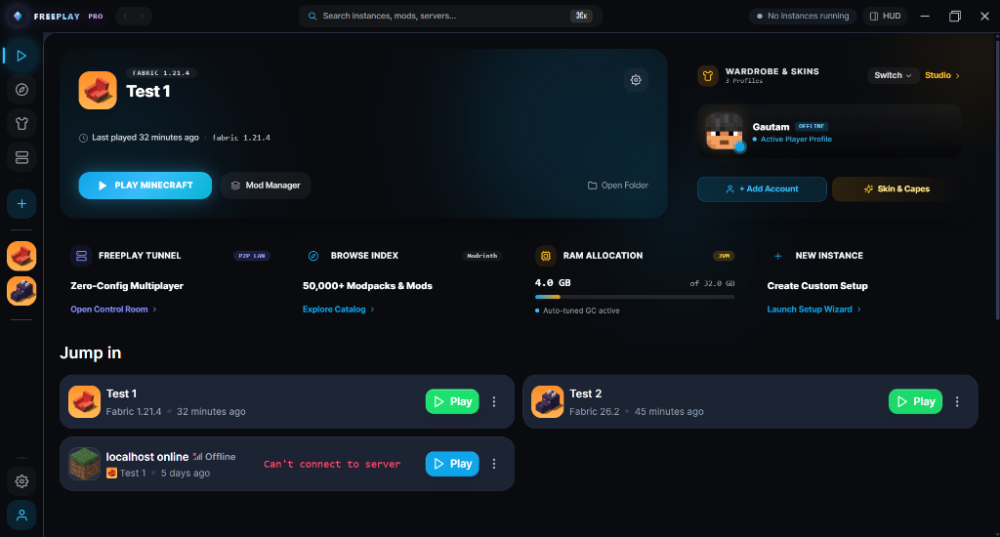
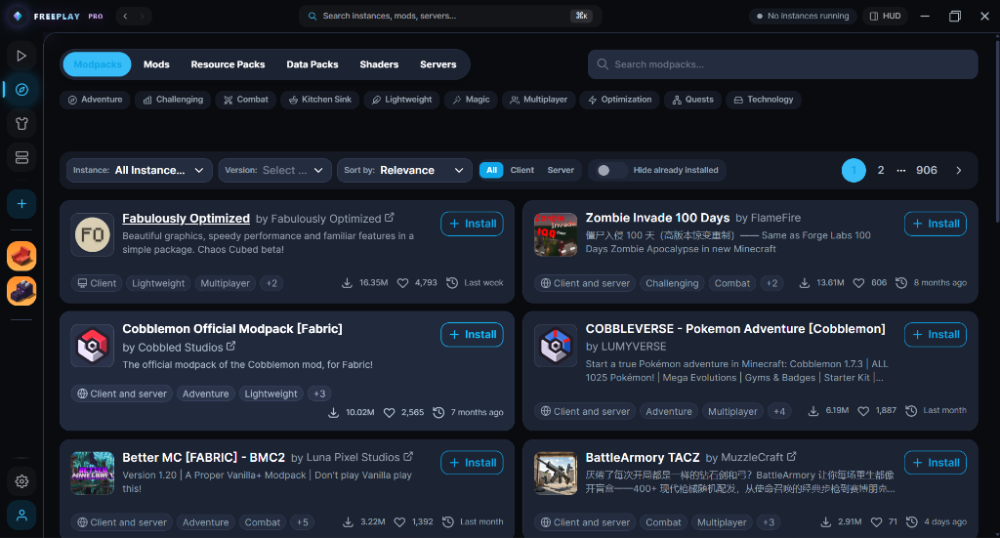
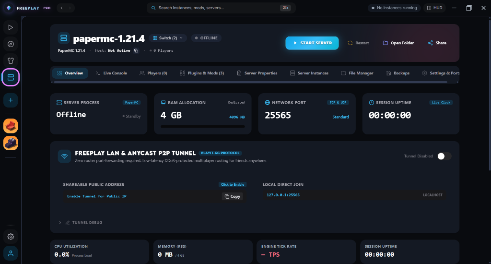
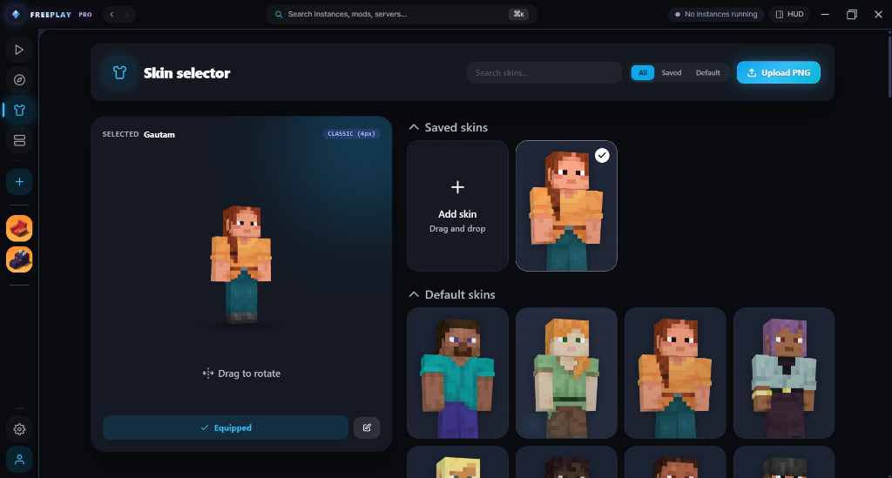

# ⚡ FreePlay Minecraft Launcher & Server Hub

<div align="center">


### The Next-Generation, All-in-One Minecraft Launcher & Server Hosting Platform

[](https://github.com/gautamcoder235/FreePlay-Minecraft-Launcher/releases/tag/V1.0.1)
[](LICENSE)
[](https://tauri.app)
[](https://www.rust-lang.org)
[](https://vuejs.org)
[](https://github.com/gautamcoder235/FreePlay-Minecraft-Launcher/releases)

[**📥 Download Latest Release (v1.0.1)**](https://github.com/gautamcoder235/FreePlay-Minecraft-Launcher/releases/tag/V1.0.1) • [**✨ Features**](#-core-features) • [**📸 Panels & UI Showcase**](#-panels--ui-showcase) • [**🛠️ Build from Source**](#️-building-from-source)

</div>

---

## 📖 Overview

**FreePlay** is a modern, high-performance, open-source Minecraft launcher and dedicated server hosting station. Built from the ground up with **Rust** and **Tauri v2**, FreePlay combines blazing-fast instance management with a full-blown local and cloud-tunneled server control room, an in-game HUD overlay (`Shift+Tab`), and seamless Windows System Tray integration.

Whether you're playing single-player modpacks, hosting multiplayer dedicated servers with zero-config tunneling, or managing complex mod environments, FreePlay gives you complete control with unmatched speed and aesthetic elegance.

---

## ✨ Core Features

### 🚀 1. Advanced Instance & Content Engine
- **Multi-Loader Support**: Full native support for **Fabric**, **Forge**, **NeoForge**, **Quilt**, and **Vanilla**.
- **Modpack Ecosystem**: Instant 1-click modpack browsing, installation, and automatic dependency resolution.
- **Granular Content Management**: Add, toggle, update, or remove individual mods, resource packs, shaders, and datapacks directly from the UI.
- **Java Runtime Management**: Automatic Java version detection, auto-download, and tailored memory/JVM flag configuration (including Aikar's flags).

### ⚡ 2. Built-in Server Control Room & Hosting
- **Multi-Engine Server Hosting**: Create and manage local dedicated servers using **PaperMC**, **Purpur**, **Fabric**, **Spigot**, or **Vanilla**.
- **Live Server Telemetry**: Real-time monitoring of CPU utilization, RAM usage, MSPT (Milliseconds Per Tick), TPS (Ticks Per Second), and disk metrics.
- **Player Manager Hub**: Live online player roster with 1-click Operator (OP), Kick, Ban, and Teleport controls.
- **Zero-Config Multiplayer Tunnels**: Integrated tunneling allows friends to join your local server anywhere in the world without opening router ports.
- **Visual Properties Editor & Backups**: Edit `server.properties` with an intuitive graphical form and manage automated world backups with single-click restore.

### 🥋 3. 3D Wardrobe & Interactive Skin Studio
- **3D Skin Visualizer**: Real-time 3D interactive viewport with drag-to-rotate preview.
- **Custom Skin Management**: Single-click PNG uploads, saved skins library, and instant profile switching.

### 🪟 4. Windows System Tray Quick Switcher
- **Dynamic Context Menu**: Access all your created instances and servers directly from the Windows taskbar overflow area.
- **Real-Time Status Indicators**: View running state (`⏹ Stop (Running)` vs `▶ Start` / `⚡ Start`) in real-time.
- **Automated Multi-Server Switching**: Starting a server from the tray gracefully shuts down any existing server, switches the active view in the UI, and boots the chosen server.
- **Instant Restore**: Left-click the tray icon to bring FreePlay immediately into focus.

### 🕹️ 5. In-Game HUD Overlay (`Shift+Tab` / `F8`)
- **Zero-Latency Transparent HUD**: Opens right inside your Minecraft game without switching windows.
- **Live Telemetry & Controls**: Monitor server health, player roster, addon browser, and time while actively playing.
- **Background Pre-Warming**: Pre-cached on app startup for instantaneous activation.

### 🛡️ 6. Safe Quit Protection
- **Accidental Close Protection**: Intercepts titlebar close, taskbar close, Alt+F4, and system tray exit to show a clean confirmation dialog.
- **Safe Shutdown**: Automatically flushes skin changes, closes server tunnels, and stops child processes cleanly.

---

## 📸 Panels & UI Showcase

### 🎮 1. Main Launcher Dashboard
The primary launchpad for managing instances, accounts, skins, RAM allocation, and quick jumping into game sessions.



---

### 📦 2. Modpack & Content Browser
Explore, filter, and install thousands of modpacks, mods, resource packs, shaders, and data packs with a single click.



---

### ⚡ 3. Server Control Room & Hosting Dashboard
The primary command center for launching, configuring, and monitoring Minecraft dedicated servers with real-time statistics, network ports, and instant tunnel sharing.



---

### 🥋 4. 3D Interactive Skin Selector & Wardrobe Studio
View, rotate, and manage your Minecraft skins with real-time 3D models and instant skin application.



---

## 📦 Downloads & Installation

Get the latest release from the [**Releases Page**](https://github.com/gautamcoder235/FreePlay-Minecraft-Launcher/releases/tag/V1.0.1):

| Package Type | File | Description |
| :--- | :--- | :--- |
| **Windows Installer (MSI)** | `FreePlay launcher_1.0.1_x64_en-US.msi` | Standard 64-bit Windows MSI Installer |
| **Windows Installer (NSIS)** | `FreePlay-Launcher_1.0.1_x64-setup.exe` | Lightweight NSIS Executable Installer |
| **Portable Package (ZIP)** | `FreePlay-Launcher-v1.0.1-windows-x64.zip` | Standalone portable executable (No installation required) |

---

## 🛠️ Building from Source

### Prerequisites
- **Node.js**: `v24+`
- **pnpm**: `v10+` (`corepack enable pnpm`)
- **Rust & Cargo**: Latest stable toolchain (`rustup default stable`)
- **C++ Build Tools**: Visual Studio C++ Build Tools (on Windows)

### 1. Clone the Repository
```bash
git clone https://github.com/gautamcoder235/FreePlay-Minecraft-Launcher.git
cd FreePlay-Minecraft-Launcher
```

### 2. Install Dependencies
```bash
pnpm install
```

### 3. Run in Development Mode
```bash
# Start desktop app with hot reload
pnpm app:dev
```

### 4. Build Production Packages
```bash
# Builds the Tauri executable and installer bundles
pnpm app:build
```
Built binaries and installer bundles will be available in `target/release/` and `target/release/bundle/`.

---

## 🏗️ Architecture & Technology Stack

- **Core Application Shell**: [Tauri v2](https://tauri.app/) (Rust + Native Win32 Subsystem)
- **Frontend Architecture**: [Vue 3](https://vuejs.org/) + [Vite 8](https://vitejs.dev/) + [Tailwind CSS v3](https://tailwindcss.com/)
- **State & Query Cache**: [TanStack Query](https://tanstack.com/query) + [Pinia](https://pinia.vuejs.org/)
- **Backend Services Engine**: `theseus` (Internal Rust library for Minecraft launching, authentication, server supervision, and networking)
- **Local Database**: SQLite with [SQLx](https://github.com/launchbadge/sqlx)

---

## 📜 License

FreePlay is open-source software licensed under the [**GPL-3.0 License**](LICENSE).

---

<br />

<div align="center">

# 🌟 Built on Modrinth
### Extra supported from playit.gg

## Go check it out at following >

### 🔗 [Modrinth — Open Source Minecraft Modding Platform](https://modrinth.com)
### 🔗 [playit.gg — Global Minecraft Tunneling & Port Forwarding](https://playit.gg)

<br />

Made with ❤️ for the Minecraft community.

</div>
