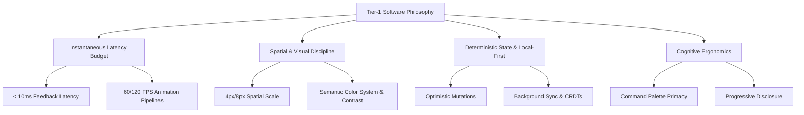

# Philosophy of Tier-1 Software

> "Software craft is the elimination of friction between human intent and machine execution."

---

## 1. Overview

Tier-1 software—exemplified by products like Apple macOS, Linear, Figma, Raycast, Cursor, and Arc Browser—occupies a distinct tier of digital product design. These tools do not merely solve functional problems; they provide an invisible extension of the user's cognitive flow.

When an application responds within 16 milliseconds, aligns strictly to a spatial grid, handles network offline states without modal alerts, and streams AI tokens with structured layout stability, it builds deep user trust.

---

## 2. The Core Pillars of Tier-1 Craft

### Pillar I: Instantaneous Latency Budget
- **0–50ms**: Instantaneous perception. Required for hover, press, focus, and keypress states.
- **50–100ms**: Slight delay felt if un-animated. Smooth spring transition bridges the gap.
- **100–300ms**: Task execution threshold. Skeleton UI or optimistic feedback mandatory.
- **300ms+**: Heavy task threshold. Must present deterministic progress or token streaming.

### Pillar II: Spatial & Visual Discipline
Tier-1 apps avoid arbitrary pixel dimensions (`margin-top: 13px`). Every layout offset, typography step, border-radius, and shadow is derived from a strict design token system built on a mathematical ratio (e.g. 4px/8px spatial rhythm, Major Third 1.25 typography ratio).

### Pillar III: Local-First & Deterministic State
Network latency should never block user interaction. A Tier-1 app writes mutations to local storage immediately, updates the UI optimistically, queues out-of-order network requests, and resolves sync conflicts gracefully.

### Pillar IV: Cognitive Ergonomics & Flow State
Users must operate at the speed of thought. This requires comprehensive keyboard navigation, command palettes (`Cmd+K`), contextual toolbars, keyboard focus trapping, and zero layout shift (CLS = 0).

---

## 3. Comparative Taxonomy: Tier-1 vs Standard Software

| Metric / Dimension | Standard Web App (Tier-3) | Professional App (Tier-2) | Tier-1 Software |
| :--- | :--- | :--- | :--- |
| **Input Latency** | 150ms - 400ms | 50ms - 150ms | **< 16ms** (1 frame) |
| **State Sync** | Server blocking (Spinner modal) | Skeleton loading screen | **Optimistic + Local-first sync** |
| **Animation Physics** | Linear CSS transitions | Fixed ease curves | **Physics-based spring dynamics** |
| **Keyboard Navigation** | Tab key works occasionally | Basic hotkeys | **100% Keyboard coverage + Cmd+K** |
| **Layout Shift (CLS)** | > 0.15 (Layout jumps on data load) | ~0.05 | **0.00 (Zero cumulative layout shift)** |
| **AI Integration** | Blocking spinner, raw JSON output | Simple typing effect | **Streaming SSE + Interruptible Agent UI** |
| **Accessibility** | Basic HTML semantic tags | WCAG 2.1 A | **WCAG 2.1 AAA + Full ARIA APG** |

---

## 4. Production Readiness Checklist

- [ ] All click & press interactions emit visual feedback within 16ms.
- [ ] No unhandled blocking loading spinners are present on primary navigation routes.
- [ ] All layout dimensions utilize tokens derived from 4px/8px spatial increments.
- [ ] Keyboard navigation permits complete operation without touch or mouse input.
- [ ] All remote mutations execute optimistically on local client state.

---

## 5. Key References

- [Apple Human Interface Guidelines - Craft](https://developer.apple.com/design/human-interface-guidelines/)
- [Linear Engineering - Building High Performance Web Apps](https://linear.app/blog/scaling-the-linear-sync-engine)
- [Ink & Switch - Local-First Software](https://www.inkandswitch.com/local-first/)
- [Nielsen Norman Group - Response Times](https://www.nngroup.com/articles/response-times-3-important-limits/)
