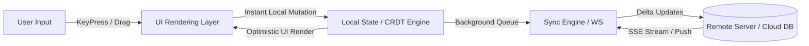

# What Makes Tier-1 Software

---

## 1. Overview

Tier-1 software is characterized by an uncompromising standard of execution across visual hierarchy, interaction physics, engineering performance, and user psychology.

When analyzing products like **Linear**, **Figma**, **Raycast**, **Cursor**, **Arc Browser**, **VS Code**, and **Apple macOS**, specific recurring patterns separate them from conventional applications.

---

## 2. Architectural Blueprint of Tier-1 Systems

### The 7 Hallmarks of Tier-1 Execution

1. **Instantaneous Local State (Zero Network Wait)**: Users never wait for a server handshake to see their action reflected. Writing a comment, checking off a issue, or moving a node updates local indexed storage instantly.
2. **Keyboard-Driven Velocity**: Every action executable by mouse can be executed faster via command palettes (`Cmd+K` / `Ctrl+K`), custom shortcuts, and sequential keybindings (`g` then `i` for Inbox).
3. **Subtle Microinteractions & Tactile Depth**: Buttons depress slightly on active state, panels slide with spring stiffness (`stiffness: 400, damping: 30`), shadows adapt dynamically to dark and light modes, and borders carry 1px semi-transparent inner highlights.
4. **Context-Aware Adaptive Interface**: UI elements appear only when needed (progressive disclosure). Inspector panels expand based on active canvas selection; action bars contextually present relevant operations.
5. **Zero Cumulative Layout Shift (CLS = 0)**: Content loading never pushes existing buttons or text blocks down. Container boundaries are pre-allocated with precise layout constraints and skeleton placeholders.
6. **Streaming & Non-Blocking AI Execution**: AI generations never lock the interface with modal loaders. Responses stream token-by-token into non-modal artifact panels or canvas cards, permitting parallel work.
7. **Flawless High-DPI & Motion Performance**: Animations run at 60 FPS or 120 FPS (ProMotion displays) using GPU-accelerated compositing transforms (`transform: translate3d`).

---

## 3. Product Case Study Summary Matrix

| Product | Hallmark Tier-1 Feature | Technical Implementation |
| :--- | :--- | :--- |
| **Linear** | Instant sync & 0ms issue editing | Local SQLite / IndexedDB + WebSocket Delta Sync |
| **Figma** | Multi-user real-time vector canvas | WebAssembly (C++) + Custom WebGL Renderer |
| **Cursor** | Inline AI agent code editing | SSE token streaming + Shadow Workspace AST parser |
| **Raycast** | Instant extension launcher | Native Swift/macOS App + Raycast React extension API |
| **Arc Browser** | Spatial sidebar & tab spaces | Custom Swift App Kit + Chromium Web Engine wrapper |
| **VS Code** | Multi-panel split editor architecture | Electron + Monaco Editor canvas / DOM hybrid tree |

---

## 4. Key References

- [Figma Engineering - Building WebGL Canvas Renderer](https://www.figma.com/blog/engineering/)
- [Linear Engineering - Scaling the Sync Engine](https://linear.app/blog/scaling-the-linear-sync-engine)
- [Apple HIG - Human Interface Guidelines](https://developer.apple.com/design/human-interface-guidelines/)
