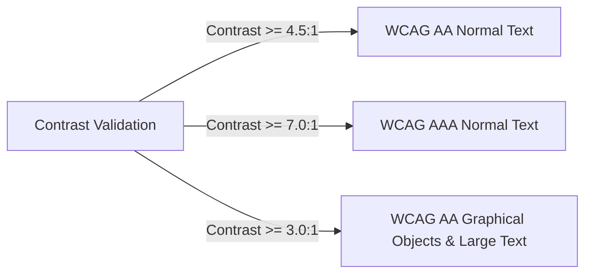

# Color Systems & Contrast Ratios

---

## 1. Overview

Color in Tier-1 software is not aesthetic decoration—it is functional telemetry. Tier-1 applications avoid raw primary hex codes (`#ff0000`, `#0000ff`). Instead, they employ systematic HSL/OKLCH color palettes, strict contrast validation matrices, and dark mode tinting mechanics.

---

## 2. Color Space & Palette Architecture (OKLCH Model)

Modern Tier-1 UI systems utilize the **OKLCH** color space over traditional RGB/HEX due to perceptual uniformity across hue changes.

$$\text{OKLCH}(L, C, H)$$
- $L$: Perceptual Lightness ($0\% \text{ to } 100\%$)
- $C$: Chroma ($0 \text{ to } 0.37$)
- $H$: Hue angle ($0^\circ \text{ to } 360^\circ$)

```css
:root {
  /* Neutral Palette Stack (Lightness Gradient at Constant Chroma) */
  --neutral-0:   oklch(99% 0.005 240); /* Pure White Tint */
  --neutral-50:  oklch(97% 0.008 240);
  --neutral-100: oklch(93% 0.010 240); /* Subdued Background */
  --neutral-200: oklch(86% 0.012 240); /* Borders / Separators */
  --neutral-300: oklch(74% 0.015 240);
  --neutral-400: oklch(60% 0.018 240); /* Disabled Text */
  --neutral-500: oklch(48% 0.020 240); /* Muted Icons / Secondary Text */
  --neutral-600: oklch(38% 0.022 240);
  --neutral-700: oklch(28% 0.024 240);
  --neutral-800: oklch(18% 0.025 240); /* Dark Surface Base */
  --neutral-900: oklch(12% 0.025 240); /* OLED Background */
  --neutral-950: oklch(8%  0.025 240); /* Darkest Surface */

  /* Brand Accent Tokens (Linear Blue/Indigo Scale) */
  --brand-50:  oklch(96% 0.04 250);
  --brand-500: oklch(58% 0.22 250); /* Primary Action Button */
  --brand-600: oklch(50% 0.24 250); /* Hover State */
  --brand-700: oklch(42% 0.22 250); /* Active State */
}
```

---

## 3. WCAG Contrast Math & Luminance Standards

Relative Luminance ($L$) calculation per WCAG 2.1:

$$L = 0.2126 R + 0.7152 G + 0.0722 B$$

Contrast Ratio between two surfaces ($L_1$ brighter, $L_2$ darker):

$$\text{Contrast Ratio} = \frac{L_1 + 0.05}{L_2 + 0.05}$$



### Contrast Decision Matrix

| Interface Element | Minimum WCAG Ratio | Standard Ratio Target | Resulting Fail Outcome |
| :--- | :--- | :--- | :--- |
| **Primary Body Text** | 4.5:1 (AA) | **7:1+ (AAA)** | Unreadable for low-vision users |
| **Subdued Caption Text** | 4.5:1 (AA) | **5.5:1** | Fails outdoor display visibility |
| **Interactive Icon** | 3.0:1 (AA) | **4.5:1** | User misses clickable status |
| **Focus Ring Border** | 3.0:1 (AA) | **6.0:1** | Keyboard navigation inaccessible |

---

## 4. Key References

- [W3C WCAG 2.1 Color Contrast](https://www.w3.org/TR/WCAG21/#contrast-minimum)
- [W3C Color Module Level 4 - OKLCH Specification](https://www.w3.org/TR/css-color-4/)
- [Apple HIG - Color Palette Design](https://developer.apple.com/design/human-interface-guidelines/color)
