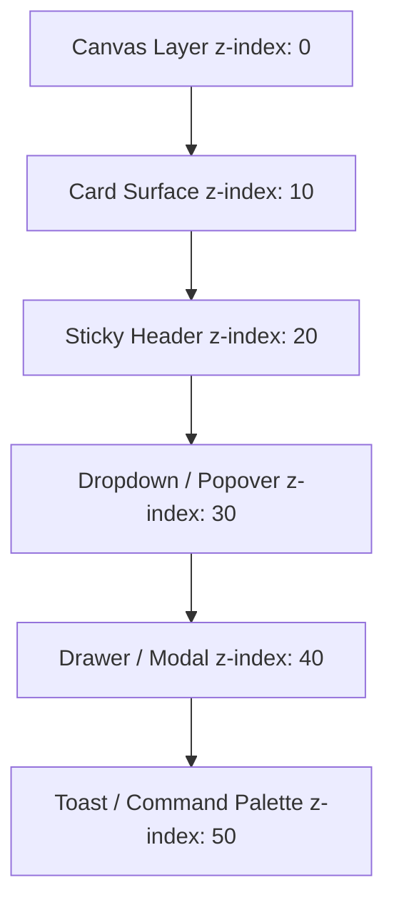

# Elevation, Layered Shadows & Depth Architecture

---

## 1. Overview

Elevation in Tier-1 design communicates spatial hierarchy along the Z-axis ($Z$). Standard applications rely on single-layer flat drop shadows (`box-shadow: 0 4px 6px #000`), which appear muddy on high-density displays and fail in dark themes. 

Tier-1 applications stack multi-layered ambient and directional key shadows combined with subtle 1px semi-transparent borders.

---

## 2. Mathematical Shadow Stacking Model

$$\text{Shadow}_{\text{layered}} = \text{Shadow}_{\text{ambient}} + \text{Shadow}_{\text{directional}} + \text{Border}_{\text{inner}}$$

```css
:root {
  /* Elevation Tokens (Light Mode Layering) */
  --elevation-flat: 0 0 0 1px var(--border-subtle);
  
  --elevation-low: 
    0 1px 2px 0 rgba(0, 0, 0, 0.05),
    0 0 0 1px rgba(0, 0, 0, 0.06); /* Card / Input Surface */
    
  --elevation-medium: 
    0 2px 4px -1px rgba(0, 0, 0, 0.06),
    0 4px 12px -2px rgba(0, 0, 0, 0.08),
    0 0 0 1px rgba(0, 0, 0, 0.08); /* Popover / Context Menu */
    
  --elevation-high: 
    0 8px 16px -4px rgba(0, 0, 0, 0.10),
    0 20px 40px -8px rgba(0, 0, 0, 0.15),
    0 0 0 1px rgba(0, 0, 0, 0.12); /* Modal Dialog / Command Palette */
}

/* Dark Mode Elevation Adaptation (Emphasizing Inner Highlight Lines) */
:root[data-theme="dark"] {
  --elevation-low: 
    0 1px 3px 0 rgba(0, 0, 0, 0.40),
    inset 0 1px 0 0 rgba(255, 255, 255, 0.08),
    0 0 0 1px rgba(255, 255, 255, 0.05);

  --elevation-high: 
    0 12px 32px -4px rgba(0, 0, 0, 0.70),
    inset 0 1px 0 0 rgba(255, 255, 255, 0.12),
    0 0 0 1px rgba(255, 255, 255, 0.10);
}
```

---

## 3. Elevation Scale & Z-Index Taxonomy



---

## 4. Key References

- [Apple HIG - Elevation and Depth](https://developer.apple.com/design/human-interface-guidelines/)
- [Google Material Design 3 - Elevation Tokens](https://m3.material.io/styles/elevation/overview)
