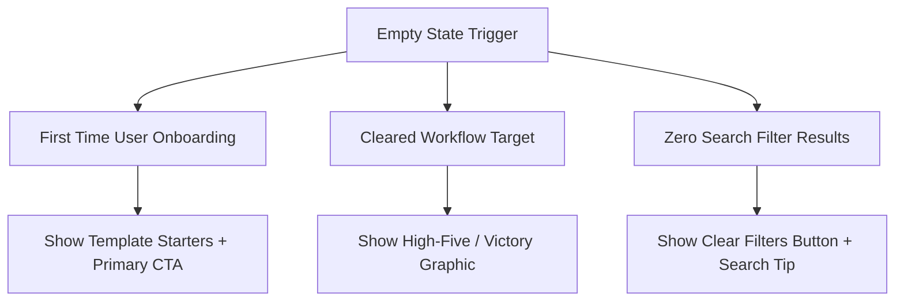

# Empty State Design & Ghost Placeholders

---

## 1. Overview

An empty state occurs when a view contains zero data items (e.g. fresh repository, cleared inbox, zero search results). Tier-1 apps transform empty states from blank dead ends into guided onboarding opportunities.

---

## 2. Empty State Architecture & Taxonomy



---

## 3. Production Component Pattern

```tsx
export function EmptyState({
  title,
  description,
  actionLabel,
  onAction,
}: {
  title: string;
  description: string;
  actionLabel?: string;
  onAction?: () => void;
}) {
  return (
    <div className="flex flex-col items-center justify-center p-8 text-center border border-dashed border-subtle rounded-xl bg-surface-base">
      <div className="w-12 h-12 mb-4 rounded-full bg-surface-active flex items-center justify-center text-secondary">
        <svg className="w-6 h-6" fill="none" viewBox="0 0 24 24" stroke="currentColor">
          <path strokeLinecap="round" strokeLinejoin="round" strokeWidth={1.5} d="M12 6v6m0 0v6m0-6h6m-6 0H6" />
        </svg>
      </div>
      <h3 className="text-md font-semibold text-primary mb-1">{title}</h3>
      <p className="text-sm text-secondary max-w-sm mb-6">{description}</p>
      {actionLabel && onAction && (
        <button onClick={onAction} className="btn-primary">
          {actionLabel}
        </button>
      )}
    </div>
  );
}
```

---

## 4. Key References

- [Nielsen Norman Group - Empty State Usability](https://www.nngroup.com/articles/empty-state-ux/)
- [Refactoring UI - Designing Empty States](https://www.refactoringui.com/)
