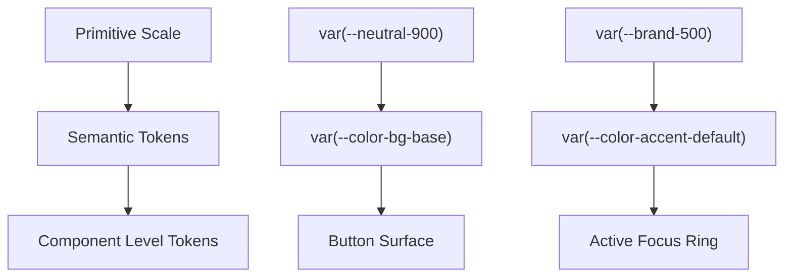

# Semantic Color Systems & Token Mapping

---

## 1. Overview

Tier-1 design systems never hardcode visual hex colors inside component styles (e.g. `color: #3b82f6`). Component code strictly references **Semantic Tokens** (`var(--color-bg-interactive-primary)`), which map to **Primitive Tokens** (`var(--brand-500)`).

This abstraction layer enables instant theme switching (Light / Dark / OLED / High-Contrast), ensures accessible contrast ratios across surface elevations, and simplifies design system maintainability.

---

## 2. Token Layering Architecture



### 3-Tier Token Schema Definition

```css
/* Tier 1: Primitive Tokens (Global Palette) */
:root {
  --blue-500: #3b82f6;
  --blue-600: #2563eb;
  --slate-900: #0f172a;
  --slate-800: #1e293b;
  --slate-100: #f1f5f9;
  --red-500: #ef4444;
  --green-500: #22c55e;
}

/* Tier 2: Semantic Tokens (Light Mode Theme Mapping) */
:root[data-theme="light"] {
  --bg-app: var(--slate-100);
  --bg-surface: #ffffff;
  --bg-surface-hover: #f8fafc;
  --bg-surface-active: #f1f5f9;
  
  --text-primary: var(--slate-900);
  --text-secondary: #64748b;
  --text-tertiary: #94a3b8;
  
  --border-subtle: #e2e8f0;
  --border-strong: #cbd5e1;
  
  --accent-default: var(--blue-600);
  --accent-hover: var(--blue-500);
  --feedback-destructive: var(--red-500);
  --feedback-success: var(--green-500);
}

/* Tier 2: Semantic Tokens (Dark Mode Theme Mapping) */
:root[data-theme="dark"] {
  --bg-app: #090d16;
  --bg-surface: var(--slate-900);
  --bg-surface-hover: var(--slate-800);
  --bg-surface-active: #334155;
  
  --text-primary: #f8fafc;
  --text-secondary: #94a3b8;
  --text-tertiary: #64748b;
  
  --border-subtle: #1e293b;
  --border-strong: #334155;
  
  --accent-default: var(--blue-500);
  --accent-hover: #60a5fa;
  --feedback-destructive: #f87171;
  --feedback-success: #4ade80;
}
```

---

## 3. Component Token Reference Table

| Component State | Semantic Token Name | Light Mode Hex | Dark Mode Hex | Minimum Contrast |
| :--- | :--- | :--- | :--- | :--- |
| **App Canvas Background** | `--bg-app` | `#f1f5f9` | `#090d16` | N/A |
| **Surface Card** | `--bg-surface` | `#ffffff` | `#0f172a` | N/A |
| **Primary Body Text** | `--text-primary` | `#0f172a` | `#f8fafc` | **15.2:1 (AAA)** |
| **Secondary Metadata** | `--text-secondary` | `#64748b` | `#94a3b8` | **5.4:1 (AA)** |
| **Subtle Divider Line** | `--border-subtle` | `#e2e8f0` | `#1e293b` | **3.1:1 (UI)** |
| **Primary Action Button** | `--accent-default` | `#2563eb` | `#3b82f6` | **4.6:1 (AA)** |

---

## 4. Key References

- [Google Material Design 3 - Color System & Tokens](https://m3.material.io/styles/color/the-color-system/tokens)
- [GitHub Primer Design System - Color Pipeline](https://primer.style/primitives/colors)
- [Apple HIG - Color Accessibility Tokens](https://developer.apple.com/design/human-interface-guidelines/color)
