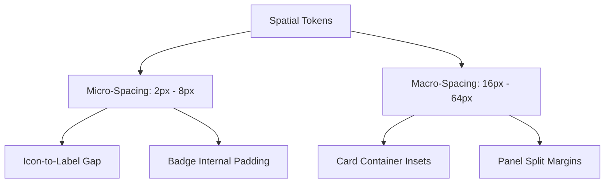

# White Space & Spatial Rhythms

---

## 1. Overview

White space (negative space) in Tier-1 applications functions as a cognitive grouping mechanism. Rather than relying on heavy bounding box lines and background colors, Tier-1 products use structured spatial padding and margins to define visual hierarchy.

---

## 2. The 4px / 8px Spatial Scale

Spatial values must derive from an **8px base grid** with a **4px micro-step** for tight inline components.

$$\text{Spacing}(n) = 4\text{px} \times n$$

```css
:root {
  /* Spatial Token Scale */
  --space-0_5: 0.125rem; /* 2px - Micro-padding (Badges, inner tags) */
  --space-1:   0.25rem;  /* 4px - Inline icon text gap */
  --space-2:   0.50rem;  /* 8px - Button internal padding, dense item gaps */
  --space-3:   0.75rem;  /* 12px - Input padding, list item gaps */
  --space-4:   1.00rem;  /* 16px - Standard card padding, toolbar gaps */
  --space-6:   1.50rem;  /* 24px - Section gaps, modal padding */
  --space-8:   2.00rem;  /* 32px - Page container padding */
  --space-12:  3.00rem;  /* 48px - Major layout panel gap */
  --space-16:  4.00rem;  /* 64px - Hero section spacing */
}
```

---

## 3. Spatial Taxonomy & Layout Application



### Spatial Application Table

| Token | Pixels | Usage Context | Example Component |
| :--- | :--- | :--- | :--- |
| `--space-1` | 4px | Tight micro-alignment | Status dot next to text label |
| `--space-2` | 8px | Component internal element gap | Icon + Button label flex gap |
| `--space-3` | 12px | Dense list row vertical padding | Data table cell padding |
| `--space-4` | 16px | Container inner inset | Card body padding |
| `--space-6` | 24px | Structural header-to-body margin | Modal header bottom margin |
| `--space-8` | 32px | Major section divider | Sidebar-to-main-canvas margin |

---

## 4. Key References

- [Refactoring UI - Spacing & Layout](https://www.refactoringui.com/)
- [Laws of UX - Law of Proximity](https://lawsofux.com/law-of-proximity/)
- [Apple HIG - Layout and Spacing](https://developer.apple.com/design/human-interface-guidelines/layout)
