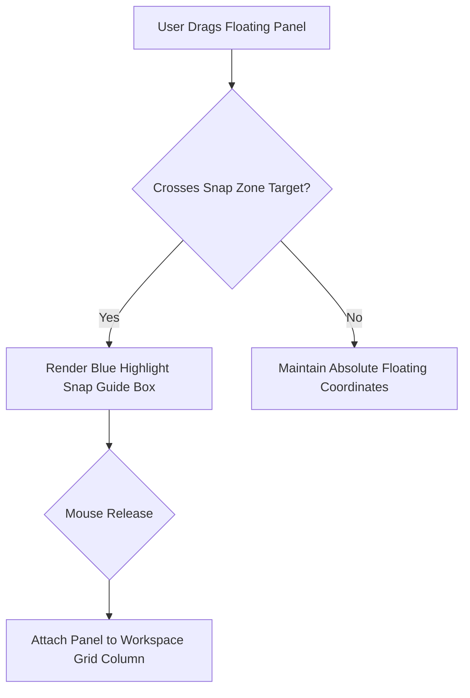

# Docking Systems & Windowing Architecture

---

## 1. Overview

Desktop creative suites (**Figma**, **Photoshop**, **Blender**) require flexible docking systems where tool panels can detach into floating overlays or snap back into layout docks.

---

## 2. Docking Snap Targets & Drag Drops

---

## 3. Key References

- [Golden Layout - Multi-Window Docking Engine](https://golden-layout.com/)
- [Figma Canvas Architecture](https://www.figma.com/blog/engineering/)
