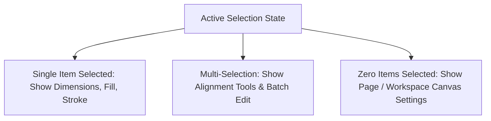

# Inspector Panels & Contextual Controls

---

## 1. Overview

Inspector panels (right sidebar in Figma, Xcode, Notion) display metadata and controls corresponding to the currently selected object. When zero elements are selected, the inspector reveals canvas-level properties.

---

## 2. Progressive Disclosure in Inspectors

---

## 3. Key References

- [Figma Inspector Architecture](https://help.figma.com/hc/en-us/articles/360039832014-Explore-the-properties-panel)
- [Apple HIG - Inspector Windows](https://developer.apple.com/design/human-interface-guidelines/inspectors)
