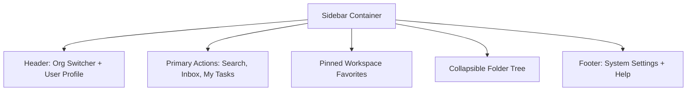

# Sidebar Design & Docking Navigation Patterns

---

## 1. Overview

Sidebars in products like **Linear**, **Arc Browser**, **Notion**, and **Slack** provide persistent spatial navigation. A Tier-1 sidebar includes workspace switchers, nested tree items, drag handles, and collapsible states.

---

## 2. Sidebar Navigation Hierarchy Taxonomy

---

## 3. Keyboard Navigation & Focus Rules

- `Tab` / `Shift+Tab`: Focuses sidebar root container or main content.
- `ArrowDown` / `ArrowUp`: Move focus between sidebar items.
- `ArrowRight`: Expands collapsed folder group.
- `ArrowLeft`: Collapses folder group.

---

## 4. Key References

- [Linear UI Architecture](https://linear.app/blog)
- [Arc Browser Sidebar UX Paradigm](https://arc.net/)
