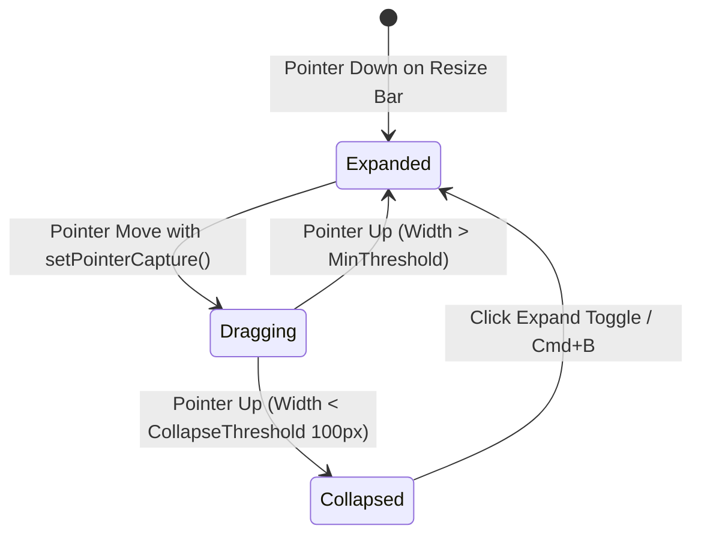

# Workspace Architecture & Multi-Panel Interfaces

---

## 1. Overview

Desktop applications like **VS Code**, **Cursor**, **Figma**, and **Linear** do not render web pages; they manage persistent workspace state environments. 

Workspace architecture coordinates persistent navigation bars, resizable sidebars, multi-document split editors, collapsible inspector sidebars, bottom terminals, and floating command palettes.

---

## 2. Master Workspace Topological Layout Diagram

```
+-----------------------------------------------------------------------------------+
| TOP TITLEBAR & APP MENU (Fixed 38px / Integrated macOS Controls)                 |
+-------------------+-------------------------------------------+-------------------+
| NAVIGATION        | PRIMARY WORKSPACE / EDITOR CANVAS         | CONTEXTUAL        |
| SIDEBAR           | (Multi-tab Document Grid)                 | INSPECTOR         |
| (Collapsible      |                                           | PANEL             |
| 240px - 400px)    |                                           | (Collapsible      |
|                   |                                           | 280px - 380px)    |
|                   +-------------------------------------------+                   |
|                   | DOCKED TERMINAL / CONSOLE (Min 180px)     |                   |
+-------------------+-------------------------------------------+-------------------+
| BOTTOM STATUS BAR (Fixed 24px - System Telemetry / Git Branch)                   |
+-----------------------------------------------------------------------------------+
```

---

## 3. Resizable Panel State Machine



---

## 4. Production Code Architecture (CSS Grid Workspace Layout)

```css
.tier1-workspace-root {
  display: grid;
  grid-template-rows: 38px 1fr 24px;
  grid-template-columns: auto 1fr auto;
  grid-template-areas:
    "titlebar titlebar titlebar"
    "sidebar  canvas   inspector"
    "statusbar statusbar statusbar";
  width: 100vw;
  height: 100vh;
  overflow: hidden;
  background-color: var(--bg-canvas);
}

.workspace-titlebar { grid-area: titlebar; }
.workspace-sidebar { grid-area: sidebar; }
.workspace-canvas { grid-area: canvas; }
.workspace-inspector { grid-area: inspector; }
.workspace-statusbar { grid-area: statusbar; }
```

---

## 5. Key References

- [VS Code Workbench Architecture Docs](https://github.com/microsoft/vscode/wiki/Architectural-Overview)
- [Figma Auto-Layout & Canvas Architecture](https://www.figma.com/blog/engineering/)
