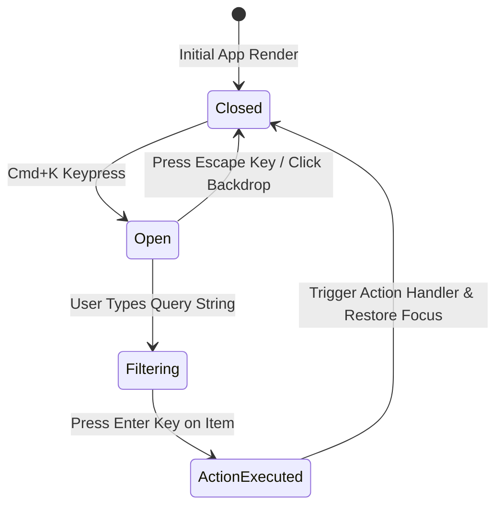

# Command Palette Architecture & Search Engine

---

## 1. Overview

Command palettes (`Cmd+K` / `Ctrl+K`) provide universal access to every navigation destination, setting toggle, and action handler within a software application.

---

## 2. Command Palette State Machine & ARIA Specifications



### ARIA APG Attributes
- Overlay Container: `role="dialog"`, `aria-modal="true"`, `aria-label="Command Palette"`.
- Search Input: `role="combobox"`, `aria-expanded="true"`, `aria-controls="command-listbox"`, `aria-activedescendant="item-active-id"`.
- Listbox: `role="listbox"`, `id="command-listbox"`.
- Items: `role="option"`, `aria-selected="true|false"`.

---

## 3. Fuzzy Matching Algorithm Integration (subsequence scoring)

```typescript
export function scoreFuzzyMatch(query: string, target: string): number {
  if (!query) return 1;
  const q = query.toLowerCase();
  const t = target.toLowerCase();
  
  if (t.startsWith(q)) return 100;
  if (t.includes(q)) return 50;

  let score = 0;
  let qIdx = 0;
  for (let i = 0; i < t.length && qIdx < q.length; i++) {
    if (t[i] === q[qIdx]) {
      score += 10;
      qIdx++;
    }
  }

  return qIdx === q.length ? score : 0;
}
```

---

## 4. Key References

- [cmdk - React Command Palette Primitive](https://cmdk.pavel.as/)
- [Raycast UX Philosophy](https://www.raycast.com/)
- [W3C ARIA APG Combobox Pattern](https://www.w3.org/WAI/ARIA/apg/patterns/combobox/)
