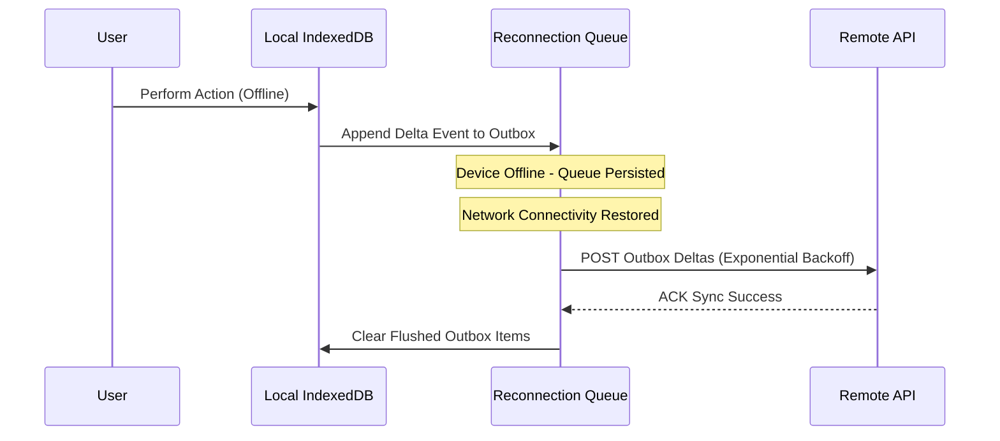

# Offline Mode & Network Reconnection Queues

---

## 1. Overview

A network disconnection should never block user interaction. Tier-1 applications queue mutations offline into IndexedDB/SQLite outbox queues and flush updates automatically upon reconnection.

---

## 2. Reconnection Outbox Queue Diagram

---

## 3. Key References

- [Ink & Switch - Local-First Software](https://www.inkandswitch.com/local-first/)
- [MDN Network Information API](https://developer.mozilla.org/en-US/docs/Web/API/Network_Information_API)
