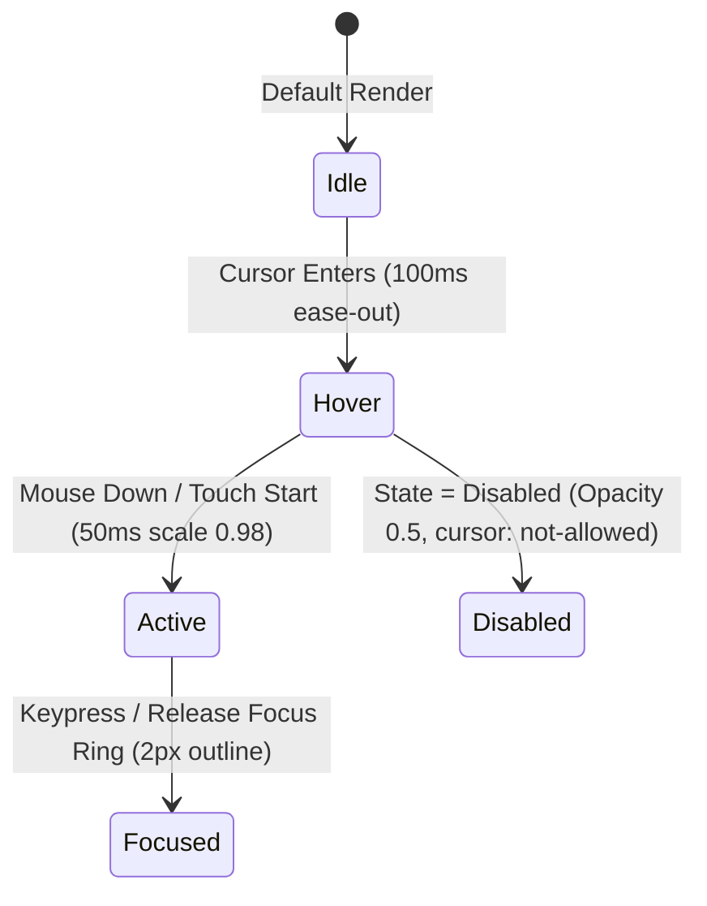

# Microinteractions & Tactile Feedback States

---

## 1. Overview

Microinteractions handle tiny single-purpose moments: button press depressions, toggle switches sliding, checkbox check animations, and star rating pops. Tier-1 applications utilize state-driven CSS and spring dynamics to make every click feel tactile.

---

## 2. Interactive Element State Machine



---

## 3. Production CSS Tactile Button Pattern

```css
.btn-tactile {
  display: inline-flex;
  align-items: center;
  justify-content: center;
  padding: var(--space-2) var(--space-4);
  border-radius: var(--radius-md);
  background: var(--accent-default);
  color: #ffffff;
  font-weight: var(--font-weight-medium);
  transition: 
    transform 80ms var(--ease-out-expo),
    background-color 150ms ease,
    box-shadow 150ms ease;
  will-change: transform;
}

.btn-tactile:hover {
  background: var(--accent-hover);
  transform: translateY(-1px);
}

.btn-tactile:active {
  transform: translateY(0) scale(0.98);
}

.btn-tactile:focus-visible {
  outline: 2px solid var(--accent-default);
  outline-offset: 2px;
}
```

---

## 4. Key References

- [Apple HIG - Buttons & Microinteractions](https://developer.apple.com/design/human-interface-guidelines/buttons)
- [Laws of UX - Fitts's Law](https://lawsofux.com/fittss-law/)
