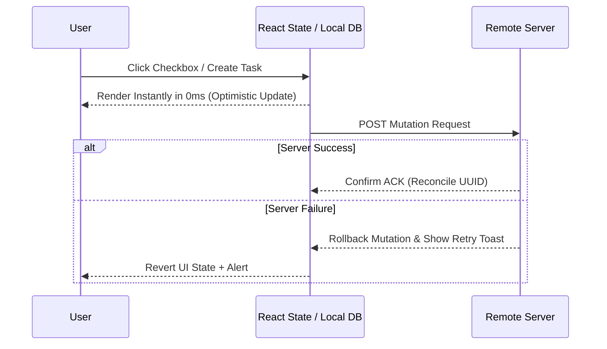

# Optimistic UI & Predictive Rendering

---

## 1. Overview

Optimistic UI updates local client state instantly upon user input without waiting for server network roundtrips.

---

## 2. Optimistic Mutation Flowchart

---

## 3. Key References

- [Linear Blog - Optimistic UI and Sync Engines](https://linear.app/blog/optimistic-ui-and-sync-engine)
- [TanStack Query Optimistic Updates Guide](https://tanstack.com/query/latest/docs/framework/react/guides/optimistic-updates)
