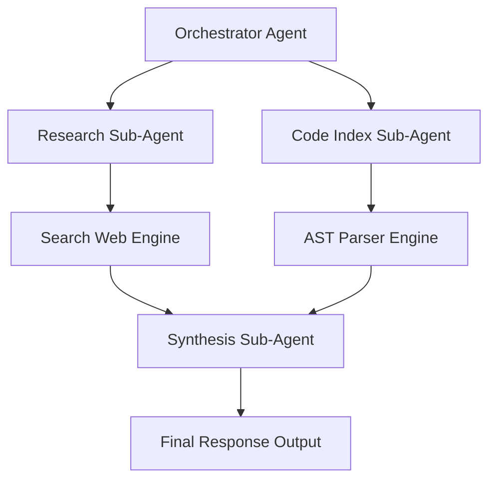

# Multi-Agent Dashboards & Orchestration UI

---

## 1. Overview

Multi-agent applications orchestrate specialized sub-agents (e.g. Research Agent, Linter Agent, Synthesis Agent). The UI visualizes sub-agent execution progress as a Directed Acyclic Graph (DAG) or hierarchical step tree.

---

## 2. Multi-Agent DAG Hierarchy Diagram

---

## 3. Key References

- [LangGraph Agent Orchestration Framework](https://www.langchain.com/langgraph)
- [OpenAI Swarm Multi-Agent Architecture](https://github.com/openai/swarm)
