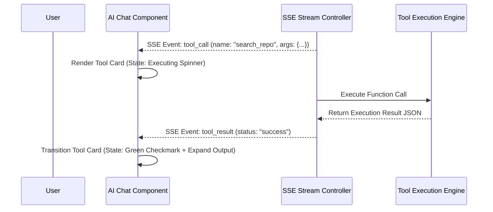

# Tool Calling UI & State Indicators

---

## 1. Overview

When AI agents invoke tools (e.g., executing code search, querying a database, invoking a linter), the UI must present deterministic execution cards displaying tool inputs, real-time logs, and success/failure indicators.

---

## 2. Tool Call Lifecycle Sequence Diagram

---

## 3. Key References

- [OpenAI Function Calling Guide](https://platform.openai.com/docs/guides/function-calling)
- [Claude Tool Use Documentation](https://docs.anthropic.com/en/docs/tool-use)
