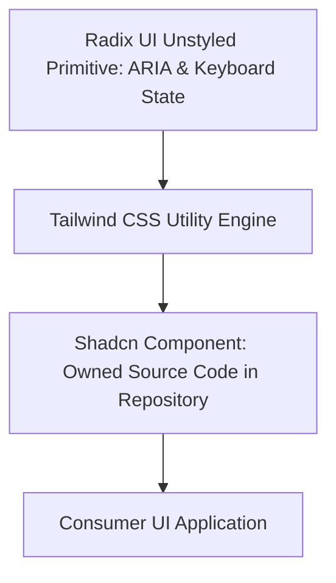

# Radix UI & Shadcn UI Architecture

---

## 1. Overview

**Radix UI** provides unstyled, accessible React primitives adhering strictly to ARIA APG keyboard and focus standards. **Shadcn UI** pairs Radix primitives with **Tailwind CSS**, copying component source code directly into projects to eliminate npm dependency lock-in.

---

## 2. Headless Primitive Architecture

---

## 3. Key References

- [Radix UI Primitives Repository](https://www.radix-ui.com/)
- [Shadcn UI Documentation](https://ui.shadcn.com/)
