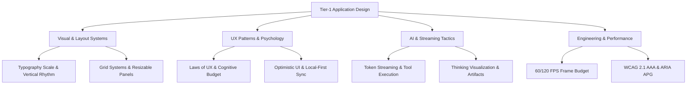

# Tier-1 Application Design Handbook

> The definitive, evergreen engineering & design reference for building world-class desktop, web, and AI-native applications comparable to Apple, Linear, Notion, Figma, Cursor, Raycast, Arc Browser, VS Code, and ChatGPT.

---

## Overview

Building Tier-1 software requires more than visual polish; it requires a deep integration of **Visual Design**, **UX Psychology**, **Interaction Physics**, **Performance UX**, **AI Infrastructure UI**, and **Accessibility**. 

This handbook provides exhaustive specifications, mathematical formulas, state machine diagrams, design tokens, TypeScript code implementations, decision matrices, and production readiness checklists.

---

## Table of Contents

| Section | Domain | Focus & Specification |
| :--- | :--- | :--- |
| **00** | [Introduction](./00-Introduction/Philosophy.md) | Tier-1 Software Philosophy & Craft Metrics |
| **01** | [Visual Design](./01-Visual-Design/Typography.md) | Typography Ratios, 4px/8px Baseline Grids, Semantic Color Tokens |
| **02** | [Layout Systems](./02-Layouts/Workspace_Architecture.md) | Resizable Multi-Panels, Inspector Architecture, Command Palettes |
| **03** | [UX Patterns](./03-UX-Patterns/Loading.md) | Skeletons vs Spinners, Toast Queues, Undo/Redo Stacks |
| **04** | [Interaction Design](./04-Interaction/Microinteractions.md) | Spring Physics, Motion Timing, Cursor Latency Budget |
| **05** | [Response Tactics](./05-Response-Tactics/Streaming_UI.md) | Local-First Architecture, Optimistic UI, Virtual Scrolling |
| **06** | [AI Applications](./06-AI-Applications/Streaming_Responses.md) | SSE Token Streaming, Tool Calling UI, Reasoning Displays |
| **07** | [Accessibility](./07-Accessibility/WCAG_Standards.md) | WCAG 2.1 AAA, Keyboard Focus Trapping, ARIA APG |
| **08** | [Themes](./08-Themes/Theme_Tokens.md) | OLED Dark Mode, Dynamic Accents, Semantic Schema |
| **09** | [Components](./09-Components/Button_Design.md) | Comprehensive Specs for Buttons, Trees, Canvas, Command Palette |
| **10** | [Performance UX](./10-Performance/Perceived_Performance.md) | 16.6ms / 8.3ms Frame Budgets, Virtualization, GPU Acceleration |
| **11** | [Design Systems](./11-Design-Systems/HIG_vs_Material_vs_Fluent.md) | Comparative Analysis of HIG, Material 3, Fluent 2, Radix |
| **12** | [UX Psychology](./12-UX-Psychology/Laws_of_UX.md) | Hick's, Fitts's, Jakob's Laws, Miller's 7±2, Peak-End Rule |
| **13** | [Engineering](./13-Engineering/State_Architecture.md) | State Management, Token Engine, Localization Architecture |
| **14** | [Case Studies](./14-Case-Studies/Linear_Case_Study.md) | Reverse-Engineered Deep Dives: Linear, Apple, Cursor, Figma, Arc |
| **15** | [Anti-Patterns](./15-Anti-Patterns/UI_UX_Anti_Patterns.md) | Catalog of 15+ Fatal UI Mistakes & Engineering Remediation |

---

## How to Use This Handbook

1. **For Designers**: Reference exact spatial scaling, color formulas, spring stiffness values, and layout grids.
2. **For Engineers**: Utilize provided TypeScript/React components, state machines, ARIA keyboard handlers, and virtualized list algorithms.
3. **For Product Architects**: Review decision tables (e.g. *Toast vs Modal*, *Optimistic vs Confirmed UI*) to avoid architectural debt.

---

## Verified References & Documentation

- [Apple Human Interface Guidelines](https://developer.apple.com/design/human-interface-guidelines/)
- [Google Material Design 3](https://m3.material.io/)
- [Microsoft Fluent Design System](https://fluent2.microsoft.design/)
- [W3C WCAG 2.1 Guidelines](https://www.w3.org/TR/WCAG21/)
- [Laws of UX](https://lawsofux.com/)
- [Linear Engineering Blog](https://linear.app/blog)
- [Ink & Switch - Local-First Software](https://www.inkandswitch.com/local-first/)
